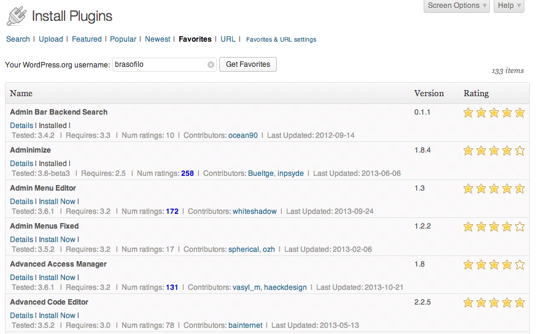

# [Favorites Plugins Sorter & Upload via URL](https://github.com/brasofilo/favorites-plugins-sorter)
*Version 2013.10.22*

####*Order and increment the number of plugins per page in the Favorites tab*

####Viewing lots of items, with extra details and sorted by name
>

####Install via URL
>

####Plugin settings
>

## Acknowledgments
###Based on WPSE post
>####[**How to Sort the Favorites Plugins Screen Alphabetically?**](http://wordpress.stackexchange.com/q/76643/12615)

>> *When viewing the Favorites Plugins tab, `/wp-admin/plugin-install.php?tab=favorites`, 
the list comes unordered, is it possible to sort it from A to Z?*

>>

>> *The problem is that the API doesn't offer an ordered query, 
so we can only sort each page results. 
The solution is to increase the number of items per page 
until no paging is necessary. The default limit is 30 plugins.*

### Embedded plugin
FPS has the plugin [**Install Via URL**](http://wordpress.org/plugins/upload-theme-via-url/) embedded into it. 
So, after <kbd>Favorites</kbd>, now there's a <kbd>URL</kbd> tab, 
to allow uploads via URL (for themes and plugins).

### Plugin updates
Native WordPress updates from GitHub using [***YahnisElsts / plugin-update-checker***](https://github.com/YahnisElsts/plugin-update-checker).

##Credits
This plugin is built and maintained by [Rodolfo Buaiz](http://brasofilo.com), aka brasofilo.

##License
This program is free software; you can redistribute it and/or modify it under the terms of the GNU General Public License as published by the Free Software Foundation; either version 2 of the License, or (at your option) any later version.

This program is distributed in the hope that it will be useful, but WITHOUT ANY WARRANTY; without even the implied warranty of MERCHANTABILITY or FITNESS FOR A PARTICULAR PURPOSE.  See the GNU General Public License for more details.

You should have received a copy of the GNU General Public License along with this program; if not, write to:

Free Software Foundation, Inc.
51 Franklin Street, Fifth Floor,
Boston, MA
02110-1301, USA.